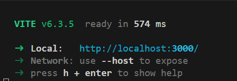

# Proyecto Final: Gestión de Canciones y Artistas 🎵

## 📌 Descripción

Aplicación web que permite gestionar artistas y canciones mediante una API REST construida con Express y Sequelize, y un frontend en React + Vite.

---

## 🚀 Instrucciones para ejecutar el proyecto

### 🔧 Backend

